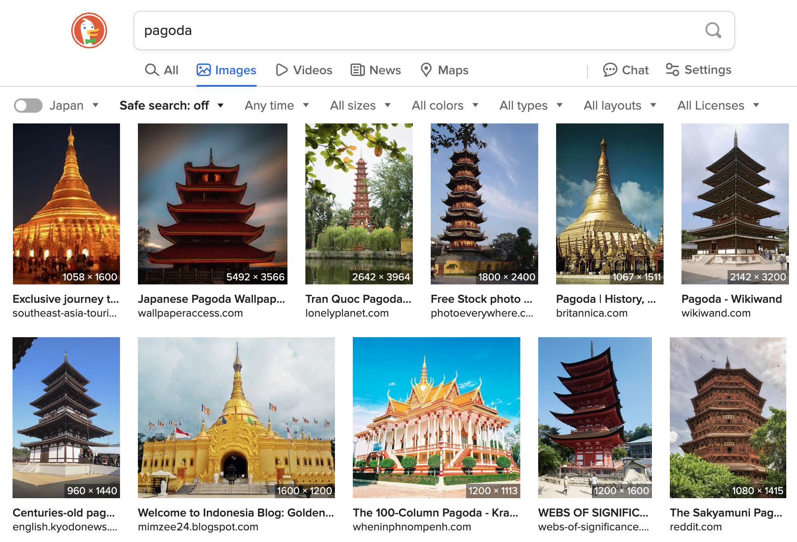
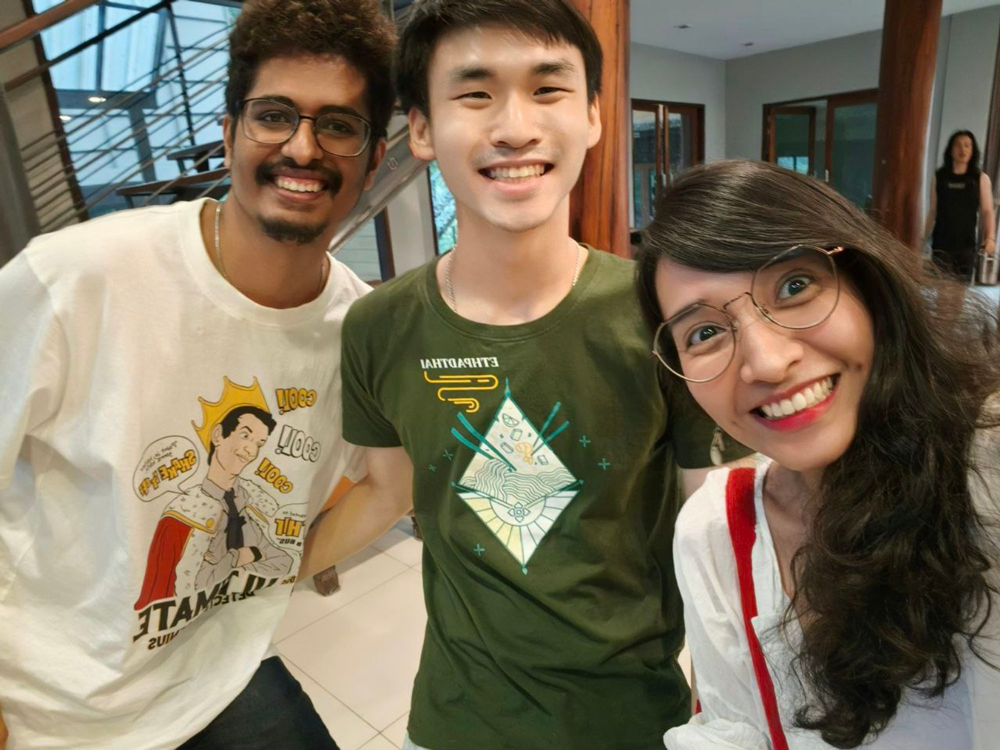
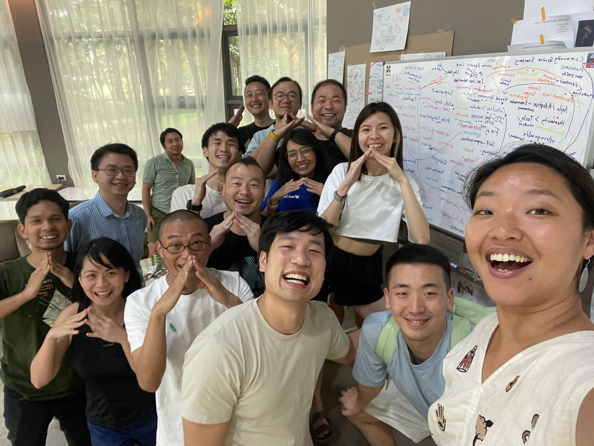

# Pagoda

## Pagoda の website へようこそ

「Pagoda」はアジアのビジョナリーたちの集まりです。

Pagoda コミュニティとしての初めての集まりは、2024 年にタイ・チェンマイで開催されました。ここで行われた 1 週間にわたる co-living を通じて、一度きりのセッションではなく、コミュニティを継続していくことを決定しました。現在、「Pagoda」はアジアのビジョナリーたちのコミュニティとして成長しています。

初めてのPagoda集会について

- この初めての Pagoda、我らのリーダー Songyi Lee が主催する怪しげな co-living 集会でした。招待制だったこの会は、[いくつかのドキュメント](https://docs.google.com/document/d/1SCLovWsdBdNwUhrapLWB0Frj9714Q3uq1iEgy--u9aI/edit)が事前に共有されていましたが、ほとんど何が起こるのかはわかっていませんでした。
- この集会は、2024 年にタイ・バンコクで開催される Devcon に向けて、アジアのビジョナリーたちが集まる場を提供することを目的としていました。この会議の中で、アジアの各国から参加しているローカルリーダーから、それぞれのエコシステムにおける文化的なバックグラウンドや課題を共有し、アジア地域の未来がどのようにあるべきかを議論しました。
- そこで、アジア地域としていくつか重点的に取り組むべき要素が見出されました。それらは内面のつながりを重視する Social, 小さな自律的なコミュニティ同士を繋げる Exchange。そしてそれらを支えるインフラストラクチャーとしての Tech に分かれ、作業を進めました。アーカイブは[ここ](https://www.notion.so/pagodasia/Dreamy-Asia-148be365f5c5456fa6cf486b29bd56b4)からご覧いただけます。
- 現在、すでに初めての Pagoda 集会は終わりましたが、今年に控えた Devcon に向けてイベントの開催やコミュニティのサポートなどがアクティブに行われています。

## Pagoda の由来

### パゴダはその印象的なバランスとシンメトリーで知られ、それは人間関係やアイデアのバランスの重要性を象徴することができる-聞くことと話すこと、教えることと学ぶこと、あるいは革新と伝統の調和。

- **信頼と尊敬の基礎**： パゴダの安定性が堅固な基礎に依存するように、人間関係の構築は実りある協力や議論に不可欠な相互の信頼と尊敬から始まる。
- **重層的な交流**： 塔の昇り段のように、人間関係やアイデアは時間をかけて発展していく。最初の交流が、より深い話し合いのための土台となり、塔の層がその高さと壮大さを増していくのと同じです。
- パゴダの共同スペースは、オープンで正直なコミュニケーションが奨励され、多様な視点が歓迎され尊重される環境づくりにつながります。
- **文化的統合**：パゴダが文化的背景に深く根ざしているように、文化的ニュアンスを理解し統合することで、より包括的で全体的なアプローチを育み、関係構築やアイデア創出を豊かにすることができる。
- **より高い理想を目指す**：パゴダの上方に伸びる建築は、人間関係や知的探求の両方において、より高い目標や価値を目指すことを象徴することができる。より重要でインパクトのある成果に向けて、平凡を超えることを目指すことを奨励する。

## Lookbook

## Pagodian による記事

[Reflections from Pagoda: Culture,Web3, and Asia](https://lightforest.world/reflections-from-pagoda-culture-web3-and-asia/), Dev

[What I learnt from Pagoda](https://twitter.com/GCCofCommons/status/1781078310660751519), Hazel

[Recap of Pagoda(JA)](https://www.facebook.com/halsk/posts/pfbid0234bem9xCmxYJpNmrCwWDS6xggTm2KxPQnToyS1V94AWNS9XiAG9x1vReBxV5dKNyl?__cft__[0), Hal

["Pagoda," a co-living camp in Thailand that brings together Asian community leaders(JA)](https://scrapbox.io/tkgshn/%E3%82%A2%E3%82%B8%E3%82%A2%E3%81%AE%E3%82%B3%E3%83%9F%E3%83%A5%E3%83%8B%E3%83%86%E3%82%A3%E3%83%AA%E3%83%BC%E3%83%80%E3%83%BC%E3%81%8C%E9%9B%86%E3%81%BE%E3%82%8B%E3%80%81%E3%82%BF%E3%82%A4%E3%81%A7%E8%A1%8C%E3%82%8F%E3%82%8C%E3%81%9Fco-living%E5%90%88%E5%AE%BF%E3%80%8CPagoda%E3%80%8D%E3%81%AB%E5%8F%82%E5%8A%A0%E3%81%97%E3%81%A6%E3%81%8D%E3%81%9F), taka

## 進行中のプロジェクト

### Pagoda Passport

ここのプロジェクトは主に Pagoda Hack Day をベースに、定期的な交流会を設けています。詳しくはイベントカレンダーを参照してください。

## Pagoda event

<iframe src="https://calendar.google.com/calendar/embed?src=128524bb0d1df46f8064603c4fdadb1f192279df938b04e161a6faa67f3b2509%40group.calendar.google.com&ctz=Asia%2FTokyo" style="border: 0" width="800" height="600" frameborder="0" scrolling="no"></iframe>

## あなたも Pagoda の一員に

Pagoda は当初、ある 1 週間の co-living の名前でしかなかったが、私たちの中では今はアジアコミュニティでのつながりを示すワードになっている。あなたが運営しているコミュニティやプロジェクトが私たちの価値観に一致するなら、ぜひ一緒に活動しましょう。

<--こちらからフォームを入力-->
